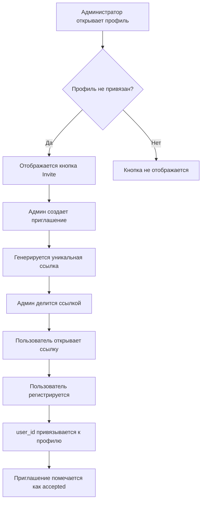

# Изменения: Система приглашений для профилей

## Краткое описание

Реализована система приглашений пользователей для регистрации и автоматической привязки к существующим профилям в системе.

## Что было сделано

### 1. База данных (SQL)

**Файл:** `supabase/migrations/006_create_profile_invitations.sql`

- Создана таблица `profile_invitations`
- Добавлены индексы для оптимизации
- Настроены RLS политики для безопасности
- Автоматическая генерация уникальных токенов

### 2. Страница профиля

**Файл:** `src/app/(pages)/profiles/[id]/page.tsx`

Добавлено:
- Проверка роли пользователя (админ или нет)
- Кнопка "📧 Пригласить к регистрации" (только для админов)
- Форма создания приглашения
- Отображение активного приглашения
- Кнопка копирования ссылки-приглашения
- Уведомления об успехе/ошибках

Функционал отображается только если:
- Пользователь является администратором
- Профиль еще не привязан к аккаунту (`user_id` пуст)

### 3. Страница регистрации

**Файл:** `src/app/register/[token]/page.tsx` (новый)

Функционал:
- Загрузка и валидация приглашения по токену
- Проверка срока действия
- Отображение информации о профиле
- Форма регистрации (email предзаполнен)
- Автоматическая привязка `user_id` к профилю
- Создание записи в `user_profiles`
- Обновление статуса приглашения

### 4. Документация

**Файлы:**
- `HOW_TO_INVITE_USERS.md` - Подробная инструкция по использованию
- `PROFILE_INVITE_CHANGES.md` - Это файл с описанием изменений

## Процесс использования



## Безопасность

### RLS Политики

1. **Создание**: Только админы
2. **Чтение**: Все (только активные по токену)
3. **Обновление**: Только админы
4. **Удаление**: Только workspace_owner

### Валидация

- Токен уникален и генерируется автоматически
- Приглашение действительно 7 дней
- Проверка статуса (pending/accepted)
- Проверка срока действия
- Email предзаполняется из приглашения (защита от подмены)

## Технические детали

### Используемые технологии

- **Next.js 15** - React фреймворк
- **Supabase** - База данных и аутентификация
- **TypeScript** - Типизация
- **Tailwind CSS** - Стилизация

### Важные функции

#### `handleCreateInvitation` (страница профиля)
```typescript
// Создает приглашение и сохраняет в БД
// Генерирует токен автоматически
// Возвращает ссылку для копирования
```

#### `handleRegister` (страница регистрации)
```typescript
// 1. Регистрирует пользователя через Supabase Auth
// 2. Обновляет profile.user_id
// 3. Создает запись в user_profiles
// 4. Обновляет статус приглашения
```

## Запуск

### 1. Выполните миграцию

```bash
# В Supabase Dashboard -> SQL Editor
# Выполните: supabase/migrations/006_create_profile_invitations.sql
```

### 2. Перезапустите приложение

```bash
npm run dev
```

### 3. Проверьте функционал

1. Войдите как администратор
2. Откройте любой профиль без `user_id`
3. Нажмите "Пригласить к регистрации"
4. Создайте приглашение
5. Скопируйте и откройте ссылку в инкогнито-режиме
6. Завершите регистрацию

## Проверка работы

```sql
-- Проверка созданных приглашений
SELECT * FROM profile_invitations ORDER BY created_at DESC LIMIT 10;

-- Проверка привязки профилей
SELECT 
    p.id,
    p.first_name,
    p.last_name,
    p.email,
    p.user_id,
    CASE WHEN p.user_id IS NOT NULL THEN '✅ Привязан' ELSE '❌ Не привязан' END as status
FROM profile p
ORDER BY p.created_at DESC;
```

## Возможные улучшения (Future)

1. ✉️ **Email отправка** - Автоматическая отправка приглашений на email
2. 📊 **История приглашений** - Список всех приглашений на странице профиля
3. 🔄 **Повторная отправка** - Возможность создать новое приглашение, если старое истекло
4. ⚙️ **Настройки срока действия** - Возможность менять срок через UI
5. 🔔 **Уведомления** - Оповещение админов о принятых приглашениях
6. 📱 **QR-код** - Генерация QR-кода для приглашения

## Файлы изменений

### Новые файлы
- ✅ `supabase/migrations/006_create_profile_invitations.sql`
- ✅ `src/app/register/[token]/page.tsx`
- ✅ `HOW_TO_INVITE_USERS.md`
- ✅ `PROFILE_INVITE_CHANGES.md`

### Измененные файлы
- ✅ `src/app/(pages)/profiles/[id]/page.tsx`

## Тестирование

### Сценарий 1: Успешное приглашение

1. ✅ Админ создает приглашение
2. ✅ Генерируется уникальная ссылка
3. ✅ Пользователь регистрируется по ссылке
4. ✅ Профиль привязывается к аккаунту
5. ✅ Статус приглашения: `accepted`

### Сценарий 2: Истекшее приглашение

1. ✅ Приглашение создано более 7 дней назад
2. ✅ Пользователь открывает ссылку
3. ✅ Отображается ошибка "Срок действия истек"

### Сценарий 3: Повторное использование

1. ✅ Приглашение уже использовано (status = accepted)
2. ✅ Пользователь пытается открыть ссылку повторно
3. ✅ Отображается ошибка "Приглашение уже принято"

## Статус

✅ **Завершено и готово к использованию**

Все задачи выполнены:
- ✅ Создана миграция для таблицы profile_invitations
- ✅ Добавлена кнопка Invite на страницу профиля
- ✅ Создана страница регистрации по приглашению
- ✅ Реализована логика привязки user_id к профилю
- ✅ Создана документация

---

**Дата завершения:** 28 октября 2025  
**Версия:** 1.0.0


